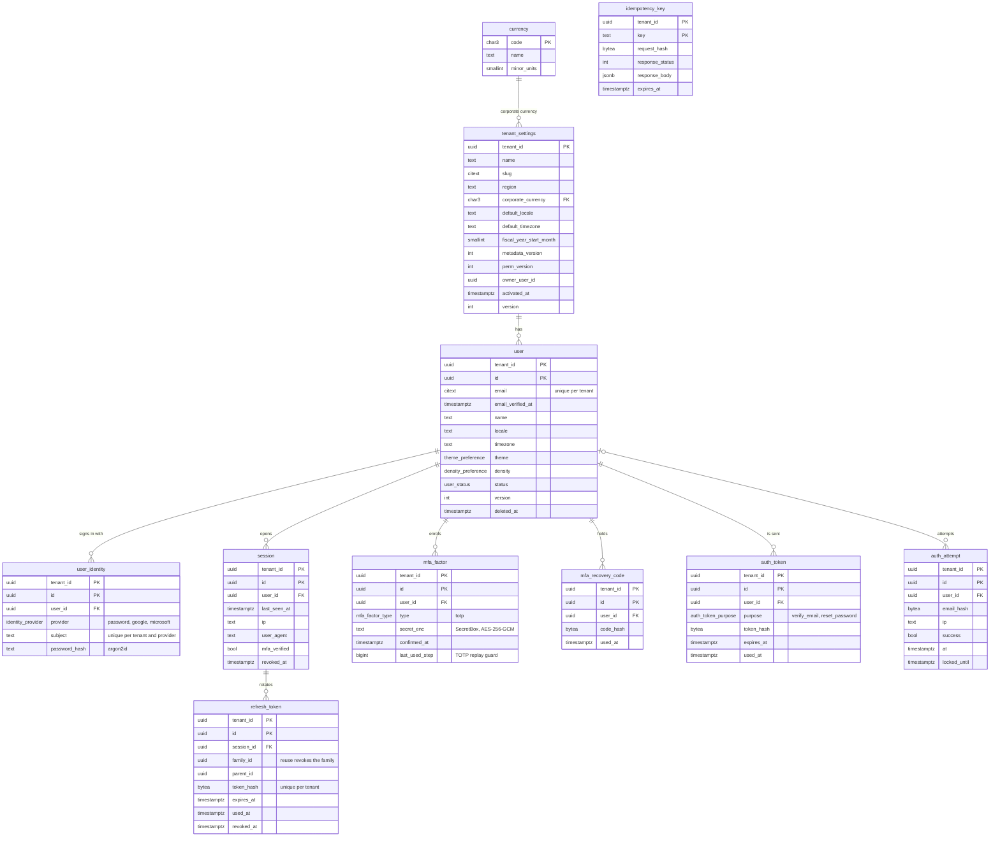
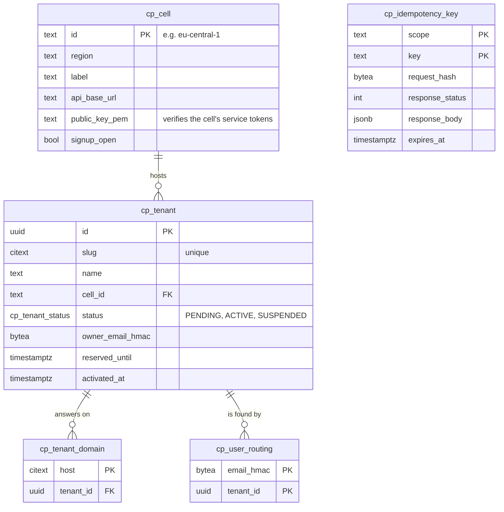

# Entity-relationship diagram

The tables that exist today, by database. Updated at the end of every phase that changes the schema
(P02 adds the metadata engine and core CRM objects). Source of truth: `packages/db/prisma/schema.prisma`
(cell) and `apps/control-api/prisma/schema.prisma` (control plane), plus the SQL migrations beside them.

## Cell database (one per regional cell)

Every tenant table leads its primary key with `tenant_id`, has row-level security **enabled and forced**
(`enable_tenant_rls()`), and is only reachable inside `withTenant()` (golden rule 1). `db:rls-audit` fails CI if a
table without a policy appears. IDs are UUIDv7. `currency` is the one global table, allow-listed by the audit.

## Control-plane database (global)

No CRM data and no tenant-scoped rows in the RLS sense: it is the directory that routes a host or an email to a cell.
Emails are stored only as HMACs (spec v1.2).

