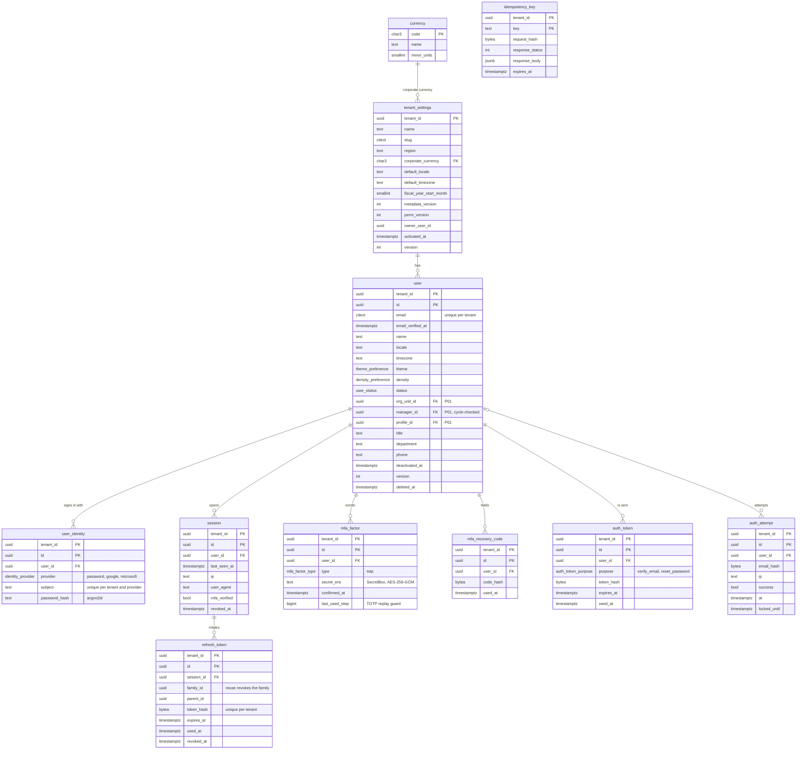
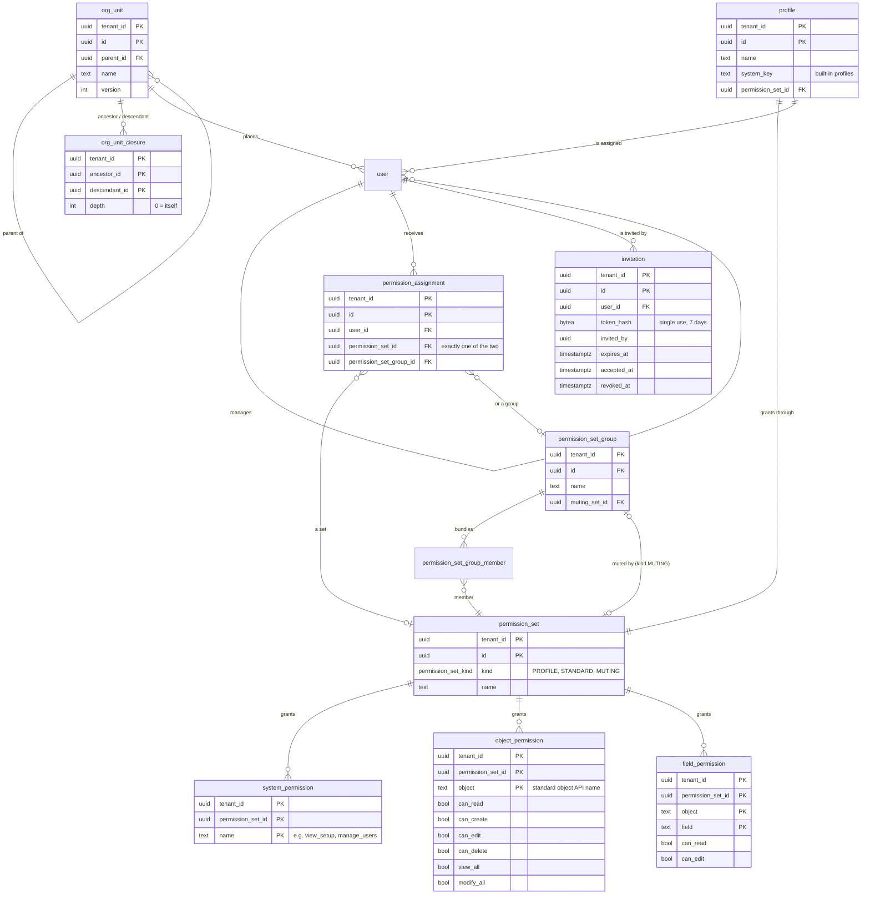
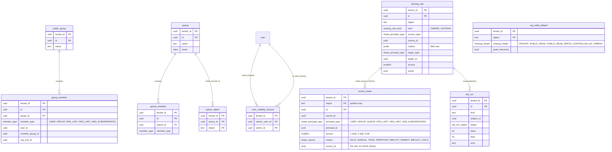
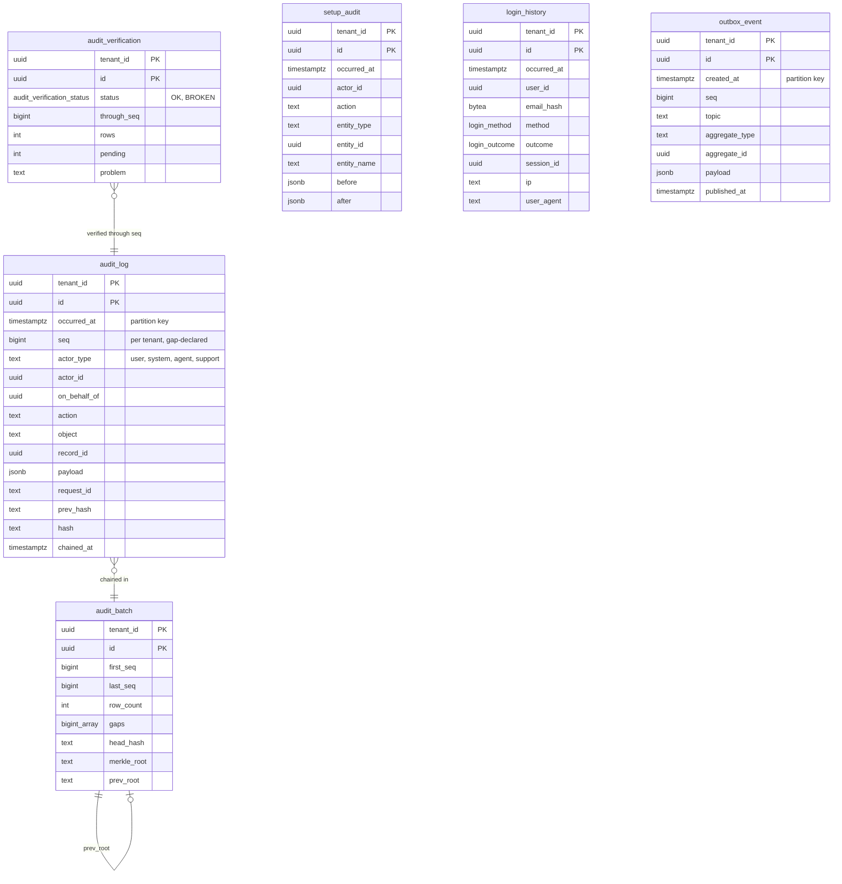
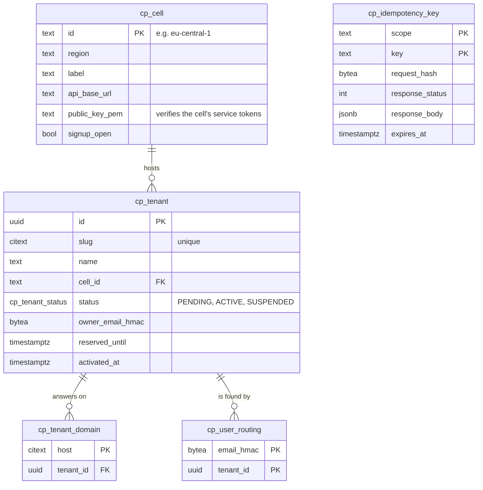

# Entity-relationship diagram

The tables that exist today, by database. Updated at the end of every phase that changes the schema
(P01 added hierarchy, permissions, sharing and governance; P02 adds the metadata engine and core CRM objects). Source of truth: `packages/db/prisma/schema.prisma`
(cell) and `apps/control-api/prisma/schema.prisma` (control plane), plus the SQL migrations beside them.

## Cell database (one per regional cell)

Every tenant table leads its primary key with `tenant_id`, has row-level security **enabled and forced**
(`enable_tenant_rls()`), and is only reachable inside `withTenant()` (golden rule 1). `db:rls-audit` fails CI if a
table without a policy appears. IDs are UUIDv7. `currency` is the one global table, allow-listed by the audit.

```mermaid
erDiagram
    tenant_settings ||--o{ user : "has"
    user ||--o{ user_identity : "signs in with"
    user ||--o{ session : "opens"
    session ||--o{ refresh_token : "rotates"
    user ||--o{ mfa_factor : "enrols"
    user ||--o{ mfa_recovery_code : "holds"
    user ||--o{ auth_token : "is sent"
    user |o--o{ auth_attempt : "attempts"
    currency ||--o{ tenant_settings : "corporate currency"

    tenant_settings {
        uuid tenant_id PK
        text name
        citext slug
        text region
        char3 corporate_currency FK
        text default_locale
        text default_timezone
        smallint fiscal_year_start_month
        int metadata_version
        int perm_version
        uuid owner_user_id
        timestamptz activated_at
        int version
    }
    user {
        uuid tenant_id PK
        uuid id PK
        citext email "unique per tenant"
        timestamptz email_verified_at
        text name
        text locale
        text timezone
        theme_preference theme
        density_preference density
        user_status status
        uuid org_unit_id FK "P01"
        uuid manager_id FK "P01, cycle-checked"
        uuid profile_id FK "P01"
        text title
        text department
        text phone
        timestamptz deactivated_at
        int version
        timestamptz deleted_at
    }
    user_identity {
        uuid tenant_id PK
        uuid id PK
        uuid user_id FK
        identity_provider provider "password, google, microsoft"
        text subject "unique per tenant and provider"
        text password_hash "argon2id"
    }
    session {
        uuid tenant_id PK
        uuid id PK
        uuid user_id FK
        timestamptz last_seen_at
        text ip
        text user_agent
        bool mfa_verified
        timestamptz revoked_at
    }
    refresh_token {
        uuid tenant_id PK
        uuid id PK
        uuid session_id FK
        uuid family_id "reuse revokes the family"
        uuid parent_id
        bytea token_hash "unique per tenant"
        timestamptz expires_at
        timestamptz used_at
        timestamptz revoked_at
    }
    mfa_factor {
        uuid tenant_id PK
        uuid id PK
        uuid user_id FK
        mfa_factor_type type "totp"
        text secret_enc "SecretBox, AES-256-GCM"
        timestamptz confirmed_at
        bigint last_used_step "TOTP replay guard"
    }
    mfa_recovery_code {
        uuid tenant_id PK
        uuid id PK
        uuid user_id FK
        bytea code_hash
        timestamptz used_at
    }
    auth_token {
        uuid tenant_id PK
        uuid id PK
        uuid user_id FK
        auth_token_purpose purpose "verify_email, reset_password"
        bytea token_hash
        timestamptz expires_at
        timestamptz used_at
    }
    auth_attempt {
        uuid tenant_id PK
        uuid id PK
        uuid user_id FK
        bytea email_hash
        text ip
        bool success
        timestamptz at
        timestamptz locked_until
    }
    idempotency_key {
        uuid tenant_id PK
        text key PK
        bytea request_hash
        int response_status
        jsonb response_body
        timestamptz expires_at
    }
    currency {
        char3 code PK
        text name
        smallint minor_units
    }
```

### Hierarchy and permissions (P01)

The org tree keeps a closure table (every ancestor–descendant pair with its depth), maintained in the same
transaction by SQL functions; a move rewrites the subtree's paths and refuses cycles. A profile _is_ a permission
set of kind `PROFILE`, so one set of grant tables serves profiles, permission sets and muting sets. Every grant change
bumps `tenant_settings.perm_version` through triggers, which retires cached effective permissions and principals.

```mermaid
erDiagram
    org_unit ||--o{ org_unit : "parent of"
    org_unit ||--o{ org_unit_closure : "ancestor / descendant"
    org_unit ||--o{ user : "places"
    user ||--o{ user : "manages"
    profile ||--|| permission_set : "grants through"
    profile ||--o{ user : "is assigned"
    user ||--o{ permission_assignment : "receives"
    permission_assignment }o--o| permission_set : "a set"
    permission_assignment }o--o| permission_set_group : "or a group"
    permission_set_group ||--o{ permission_set_group_member : "bundles"
    permission_set_group_member }o--|| permission_set : "member"
    permission_set_group |o--o| permission_set : "muted by (kind MUTING)"
    permission_set ||--o{ system_permission : "grants"
    permission_set ||--o{ object_permission : "grants"
    permission_set ||--o{ field_permission : "grants"
    user ||--o{ invitation : "is invited by"

    org_unit {
        uuid tenant_id PK
        uuid id PK
        uuid parent_id FK
        text name
        int version
    }
    org_unit_closure {
        uuid tenant_id PK
        uuid ancestor_id PK
        uuid descendant_id PK
        int depth "0 = itself"
    }
    profile {
        uuid tenant_id PK
        uuid id PK
        text name
        text system_key "built-in profiles"
        uuid permission_set_id FK
    }
    permission_set {
        uuid tenant_id PK
        uuid id PK
        permission_set_kind kind "PROFILE, STANDARD, MUTING"
        text name
    }
    permission_set_group {
        uuid tenant_id PK
        uuid id PK
        text name
        uuid muting_set_id FK
    }
    permission_assignment {
        uuid tenant_id PK
        uuid id PK
        uuid user_id FK
        uuid permission_set_id FK "exactly one of the two"
        uuid permission_set_group_id FK
    }
    system_permission {
        uuid tenant_id PK
        uuid permission_set_id PK
        text name PK "e.g. view_setup, manage_users"
    }
    object_permission {
        uuid tenant_id PK
        uuid permission_set_id PK
        text object PK "standard object API name"
        bool can_read
        bool can_create
        bool can_edit
        bool can_delete
        bool view_all
        bool modify_all
    }
    field_permission {
        uuid tenant_id PK
        uuid permission_set_id PK
        text object PK
        text field PK
        bool can_read
        bool can_edit
    }
    invitation {
        uuid tenant_id PK
        uuid id PK
        uuid user_id FK
        bytea token_hash "single use, 7 days"
        uuid invited_by
        timestamptz expires_at
        timestamptz accepted_at
        timestamptz revoked_at
    }
```

### Groups, queues and sharing (P01)

Groups and queues take users, other groups, org units, or org units with everything below them; membership is
expanded transitively with cycle protection. `user_visibility_closure` lists, per viewer, the owners whose records
hierarchy access shows them (their own, their reports', and everyone's in units below theirs, plus their queues).
`record_share` is LIST-partitioned by object (one partition per standard object plus a default).

```mermaid
erDiagram
    public_group ||--o{ group_member : "contains"
    queue ||--o{ queue_member : "contains"
    queue ||--o{ queue_object : "holds records of"
    user ||--o{ user_visibility_closure : "views (viewer)"
    user ||--o{ user_visibility_closure : "is seen (owner)"
    sharing_rule ||--o{ record_share : "writes (reason RULE)"
    sharing_rule ||--o{ job_run : "recalculated by"

    public_group {
        uuid tenant_id PK
        uuid id PK
        text name
    }
    group_member {
        uuid tenant_id PK
        uuid id PK
        uuid group_id FK
        member_type member_type "USER, GROUP, ORG_UNIT, ORG_UNIT_AND_SUBORDINATES"
        uuid user_id
        uuid member_group_id
        uuid org_unit_id
    }
    queue {
        uuid tenant_id PK
        uuid id PK
        text name
        citext email
    }
    queue_member {
        uuid tenant_id PK
        uuid id PK
        uuid queue_id FK
        member_type member_type
    }
    queue_object {
        uuid tenant_id PK
        uuid queue_id PK
        text object PK
    }
    org_wide_default {
        uuid tenant_id PK
        text object PK
        sharing_model sharing_model "PRIVATE, PUBLIC_READ, PUBLIC_READ_WRITE, CONTROLLED_BY_PARENT"
        bool grant_hierarchy
    }
    user_visibility_closure {
        uuid tenant_id PK
        uuid viewer_user_id PK
        uuid owner_id PK
    }
    record_share {
        uuid tenant_id PK
        text object PK "partition key"
        uuid id PK
        uuid record_id
        share_principal_type principal_type "USER, GROUP, QUEUE, ORG_UNIT, ORG_UNIT_AND_SUBORDINATES"
        uuid principal_id
        smallint access "1 read, 2 edit, 3 full"
        share_reason reason "RULE, MANUAL, TEAM, TERRITORY, IMPLICIT_PARENT, IMPLICIT_CHILD"
        uuid source_id "the rule, for RULE shares"
    }
    sharing_rule {
        uuid tenant_id PK
        uuid id PK
        text object
        sharing_rule_kind kind "OWNER, CRITERIA"
        share_principal_type source_type
        uuid source_id
        jsonb criteria "filter tree"
        share_principal_type target_type
        uuid target_id
        smallint access
        bool active
    }
    job_run {
        uuid tenant_id PK
        uuid id PK
        text kind
        uuid subject_id
        job_run_status status
        int done
        int total
        text error
    }
```

### Governance and jobs (P01)

`audit_log` is partitioned monthly and INSERT-only for `sm_app`; only the `sm_audit` role sets `hash` and
`prev_hash`. Rows are written in the audited transaction and chained by the worker in batches, each with a Merkle
root linked to the previous batch (ADR-0008, P01 plan §3.3). `outbox_event` is partitioned daily and kept 7 days.

```mermaid
erDiagram
    audit_log }o--|| audit_batch : "chained in"
    audit_batch ||--o| audit_batch : "prev_root"
    audit_verification }o--|| audit_log : "verified through seq"

    audit_log {
        uuid tenant_id PK
        uuid id PK
        timestamptz occurred_at "partition key"
        bigint seq "per tenant, gap-declared"
        text actor_type "user, system, agent, support"
        uuid actor_id
        uuid on_behalf_of
        text action
        text object
        uuid record_id
        jsonb payload
        text request_id
        text prev_hash
        text hash
        timestamptz chained_at
    }
    audit_batch {
        uuid tenant_id PK
        uuid id PK
        bigint first_seq
        bigint last_seq
        int row_count
        bigint_array gaps
        text head_hash
        text merkle_root
        text prev_root
    }
    audit_verification {
        uuid tenant_id PK
        uuid id PK
        audit_verification_status status "OK, BROKEN"
        bigint through_seq
        int rows
        int pending
        text problem
    }
    setup_audit {
        uuid tenant_id PK
        uuid id PK
        timestamptz occurred_at
        uuid actor_id
        text action
        text entity_type
        uuid entity_id
        text entity_name
        jsonb before
        jsonb after
    }
    login_history {
        uuid tenant_id PK
        uuid id PK
        timestamptz occurred_at
        uuid user_id
        bytea email_hash
        login_method method
        login_outcome outcome
        uuid session_id
        text ip
        text user_agent
    }
    outbox_event {
        uuid tenant_id PK
        uuid id PK
        timestamptz created_at "partition key"
        bigint seq
        text topic
        text aggregate_type
        uuid aggregate_id
        jsonb payload
        timestamptz published_at
    }
```

## Control-plane database (global)

No CRM data and no tenant-scoped rows in the RLS sense: it is the directory that routes a host or an email to a cell.
Emails are stored only as HMACs (spec v1.2).

```mermaid
erDiagram
    cp_cell ||--o{ cp_tenant : "hosts"
    cp_tenant ||--o{ cp_tenant_domain : "answers on"
    cp_tenant ||--o{ cp_user_routing : "is found by"

    cp_cell {
        text id PK "e.g. eu-central-1"
        text region
        text label
        text api_base_url
        text public_key_pem "verifies the cell's service tokens"
        bool signup_open
    }
    cp_tenant {
        uuid id PK
        citext slug "unique"
        text name
        text cell_id FK
        cp_tenant_status status "PENDING, ACTIVE, SUSPENDED"
        bytea owner_email_hmac
        timestamptz reserved_until
        timestamptz activated_at
    }
    cp_tenant_domain {
        citext host PK
        uuid tenant_id FK
    }
    cp_user_routing {
        bytea email_hmac PK
        uuid tenant_id PK
    }
    cp_idempotency_key {
        text scope PK
        text key PK
        bytea request_hash
        int response_status
        jsonb response_body
        timestamptz expires_at
    }
```
